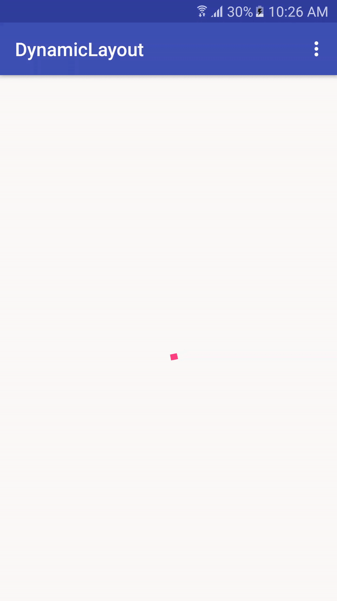

# DynamicLayout

Dynamic Layout is a layout which adds custom layouts to its child layout. Following are the below layouts:

* Loading
* Showing errors
* and Even showing Custom Views

##How to use

We need to include DynamicLayout in the layout file. This layout will have ony one child. 
  
    <com.boopi.dynamiclayout.DynamicLayout
          android:id="@+id/dynamic_layout"
          android:layout_width="match_parent"
          android:layout_height="match_parent">

          <ListView
              android:id="@+id/listview"
              android:layout_width="match_parent"
              android:layout_height="match_parent" />
    </com.boopi.dynamiclayout.DynamicLayout>
    
This will automatically include all the necessary views.

####To show loading
    dynamicLayout.showLoadingLayout(true);  // true - to hide original target view, false, to show loading on top of target view
   
####To show network failure
    dynamicLayout.showInternetOffLayout(true);
    
####To show errors
    dynamicLayout.showExceptionLayout(true);
    
####To show custom layouts
    View customView = getLayoutInflater().inflate(R.layout.custom_view, null, false);
    box.addCustomView(customView,"custom_view");
    dynamicLayout.showCustomView("custom_view", true);
    
